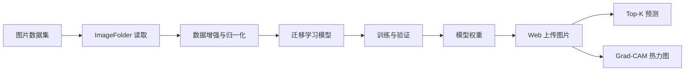

# 系统设计说明

## 模块划分

系统按职责拆为六个核心模块：

- `config.py`：读取配置、路径解析、默认值合并。
- `data.py`：图像增强、数据集读取、训练/验证/测试划分。
- `models.py`：统一构建 MobileNetV3、ResNet18、EfficientNet-B0。
- `training.py`：训练循环、评估、早停、权重保存。
- `inference.py`：权重加载、单图预测、Grad-CAM 热力图。
- `metrics.py`：混淆矩阵、每类准确率、精确率、召回率。
- `labels.py`：类别名格式化和常见 PlantVillage 类别中文显示。
- `recommendations.py`：常见病害处理建议。

入口文件只做参数解析和界面展示，核心逻辑都在 `src/plant_disease` 内复用，避免重复代码。

## 数据流

## 模型选择

默认使用 `mobilenet_v3_small`，原因是参数量较小，训练和推理速度快，适合个人电脑完成毕业设计实验。若有 GPU，可在 `config.yaml` 中切换到 `efficientnet_b0` 获得更强表达能力。
